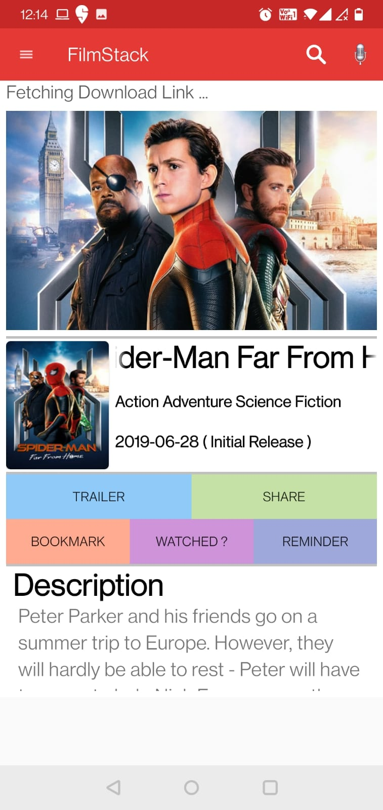
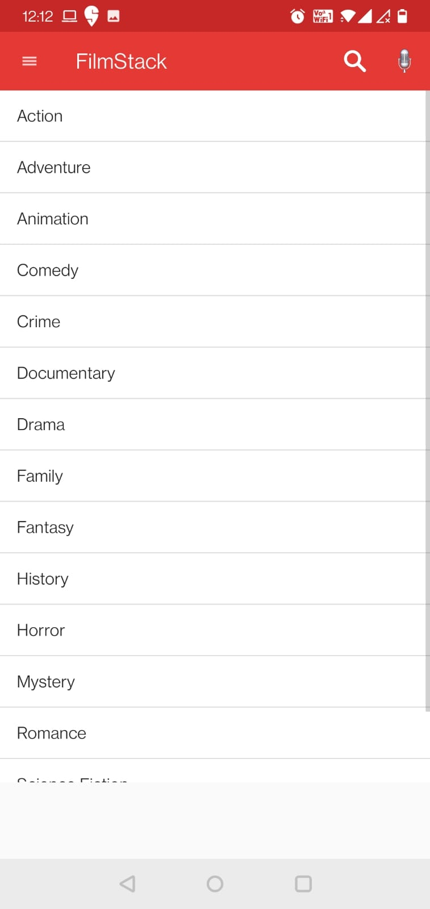
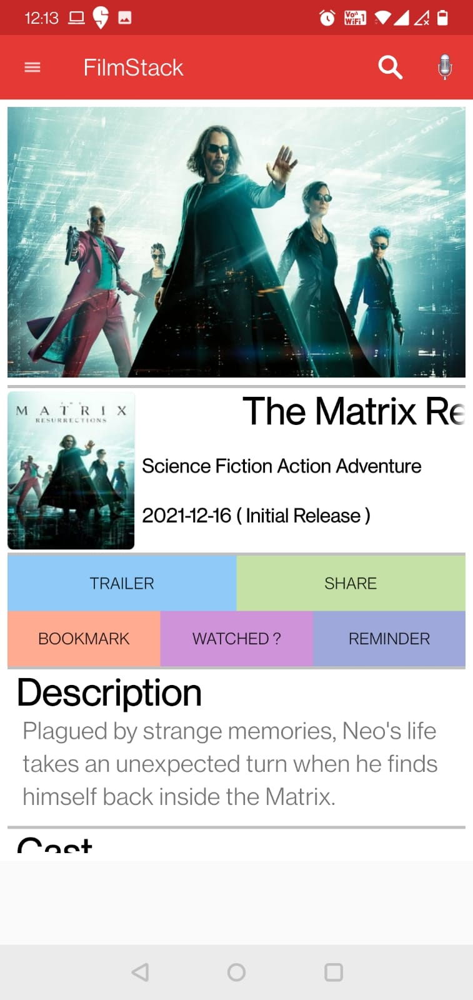
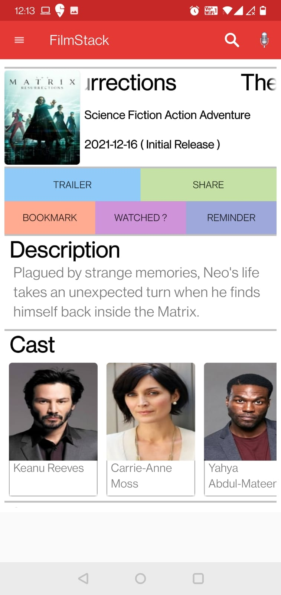
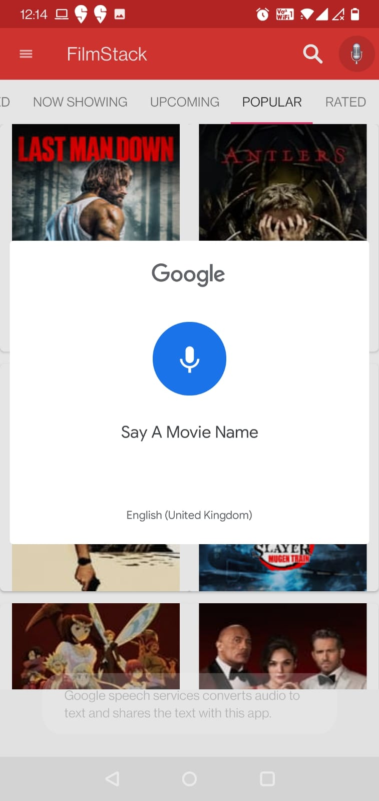
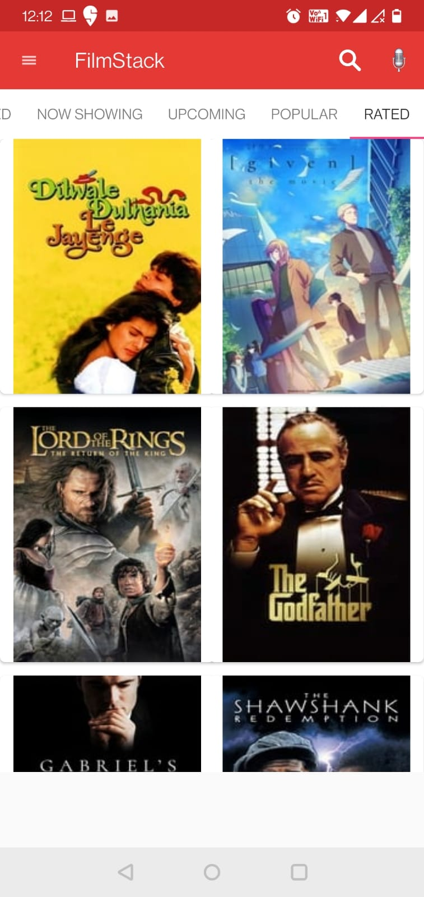
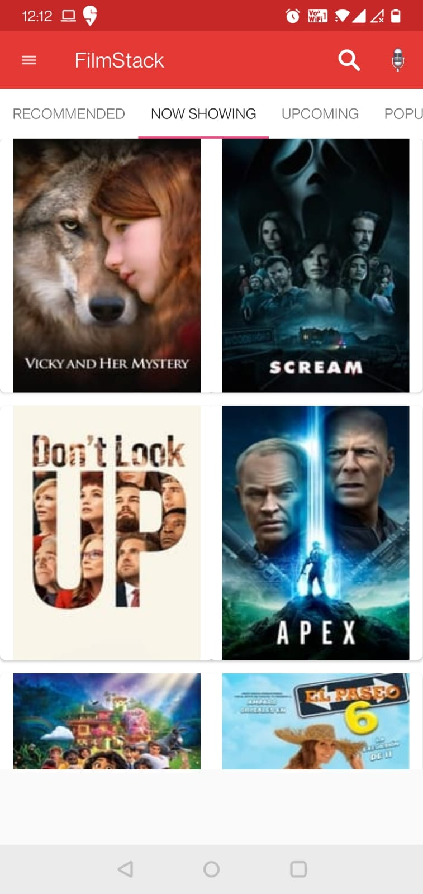
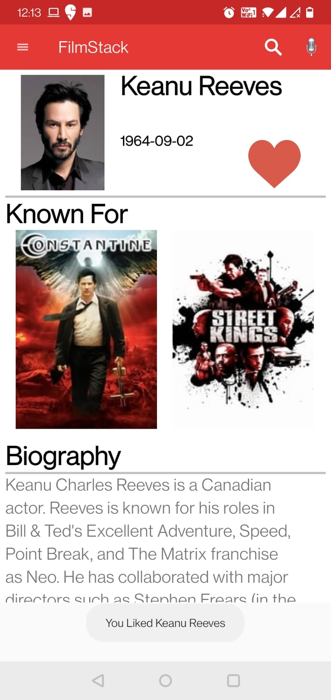

# Filmstack
Movie Recommendation App

Features of Filmstack app :- 

* Get latest, upcoming, popular and top rated movies 
* Can watch trailer of any movie
* Share movie with friends 
* Instant watch 
* Share download link with friends 
* Can search movies by genre
* Bookmark a movie for offline reading
* Set reminders for a movie  

API  - TMDB, Youtube, Openload

 

ANDROID ACTIVITY LIFE CYCLE :-
                                                     
1) ACTIVITY START -> onCreate() -> onStart() -> onResume() -> ACTIVITY RUNNING -> onPause() -> onStop() -> onDestroy()  -> ACTIVITY SHUTDOWN

HIGH LEVEL FEATURES DESCRIPTION :- 

1) RECOMMENDATION :-
    -  WE RECOMMEND MOVIES ACORDING TO USER ACTION
    -  INPUTS ARE FROM FAVOURITE ACTOR, FAVOURITE MOVIES ETC
    -  WE MAINTAIN A VALUE FOR EACH PREFERENCE AND HIGHER RATED VALUES IS SHOWN FIRST IN RECOMMENDATION
    -  WE USE FIREBASE ( NOSQL ) AND SAVE EACH USER LIKED MOVIES AND MAINTAIN A COUNTER ( MOVIEID - NO. OF USERS WHO LIKED )
    -  GET THE RECOMMEDNATION FROM FIREBASE + EACH USER PERSONAL PREFERENCE

2) WATCH MOVIES FROM INTERNET :-
    -  SEARCH FOR MOVIES ON GOOGLE SEARCH AND LOOKUP FOR MOVIES WITH "MP4" LINK 
    -  WHEN WE GET THE LINK WE SHOW THE MOVIES TO USER 

3) WATCH TRAILER OF MOVIES :- 
    -  WE HAVE CREATED A LOCAL VIDEOPLAYER WHICH PLAYS TRAILER OF MOVIES
    -  WE GET YOUTUBE LINKS FROM TMDB API

4) SET REMINDERS TO WATCH MOVIES :- 
    -  WE OPEN A WINDOW AND USER SET THE TIME
    -  TIME IS SAVED IN ALARM DATABASE ( SQLLITE )
    -  START A PENDING INTENT FOR NOTIFICATION 
    -  SET THE ALARM IN SYSTEM USING ALRAM MANGER 
    -  WHEN THE TIMES COMES UP, USER IS NOTIFIED FOR MOVIES THEY HAVE SET TO REMIND 

5) SET BOOKMARK FOR A MOVIES :- 
    -  SET BOOKMARK TO WATCH LATER MOVIES 
    -  THE MOVIES WILL BE SAVED IN WATCH LATER DB 

6) SET THEIR FAVORITRE ACTOR :-
    -  A PERSON CAN SAVE THERE FAVOURITE ACTOR
    -  THEY CAN SEARCH FOR ACTOR INFO 
    -  THEY CAN SEARCH FOR ALL ACTORS MOVIE
    -  WILL BE USED IN RECOMMENDATION 

7) SEARCH MOVIES BY GENRE
    -  THESE GENRE LIST WE GET FROM TMDB API 
    -  WE MAINTAIN A LIST VIEW FOR ALL LIST

8)  CACHING IMAGE LOCALLY 
    -  WE CACHE IMAGE LOCALLY FOR FASTER IMAGE LOADING 
    -  USING PICASSO OR DIRECTLY SAVING AS BLOB IN SQLLITE 

9)  MAINTAIN A LIST OF WATCHED MOVIES  :-
    -  WILL BE USED IN RECOMMENDATION 

10)  SPEECH TO TEXT :- 
    - SEARCH A MOVIES BY VOICE 

11)  SHARE A MOVIES TO FRIENDS 

