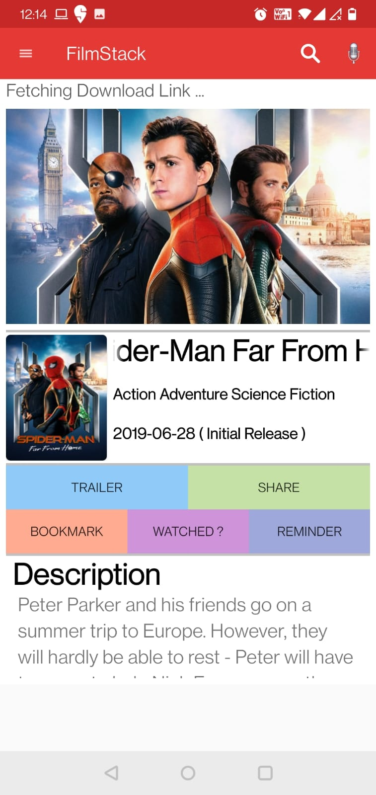
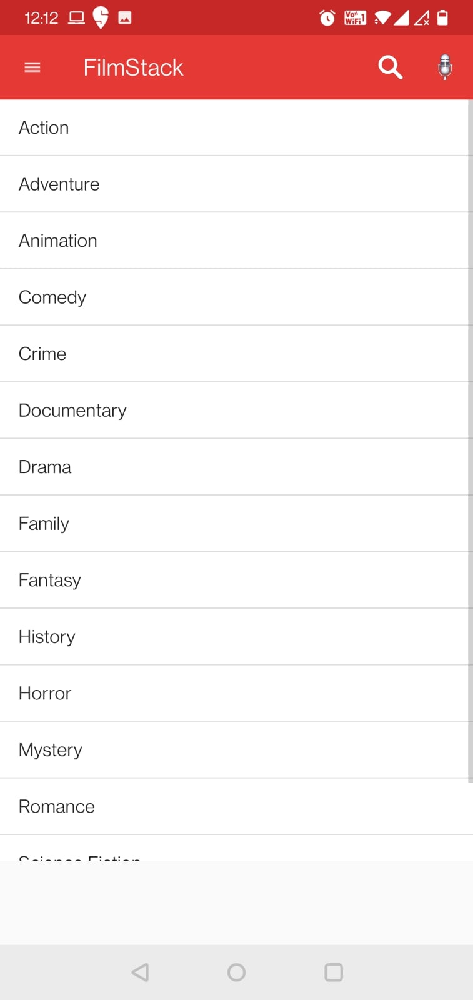
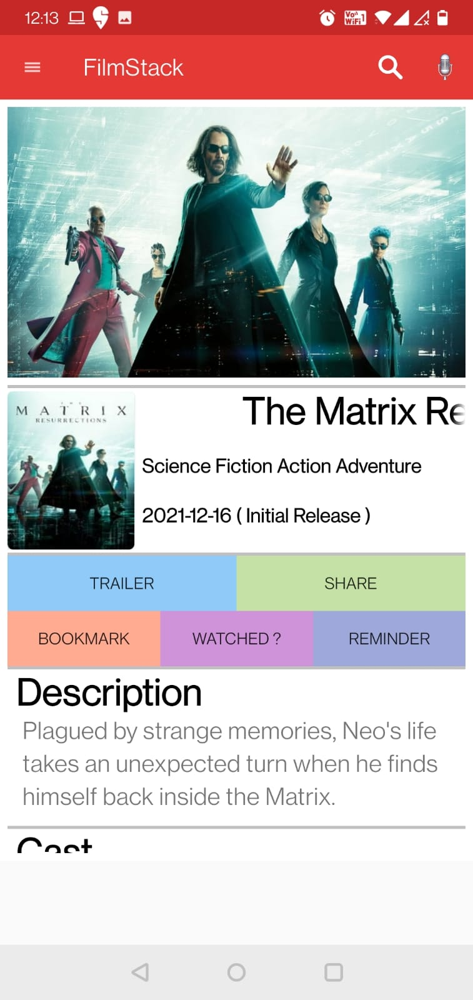
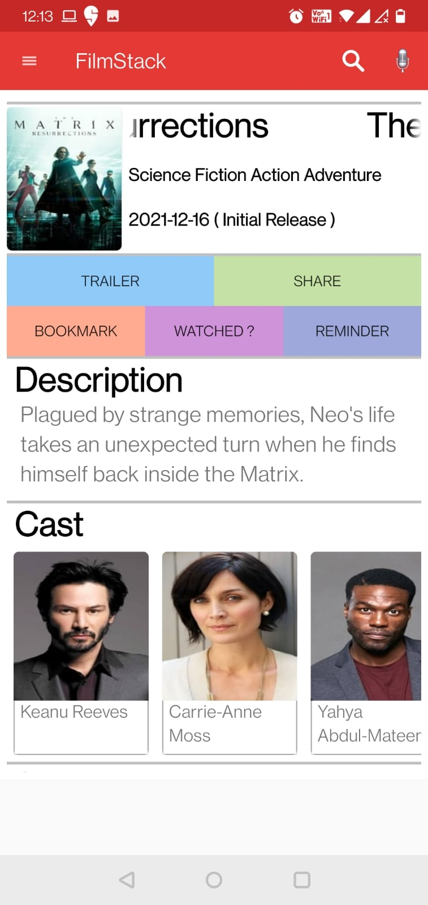
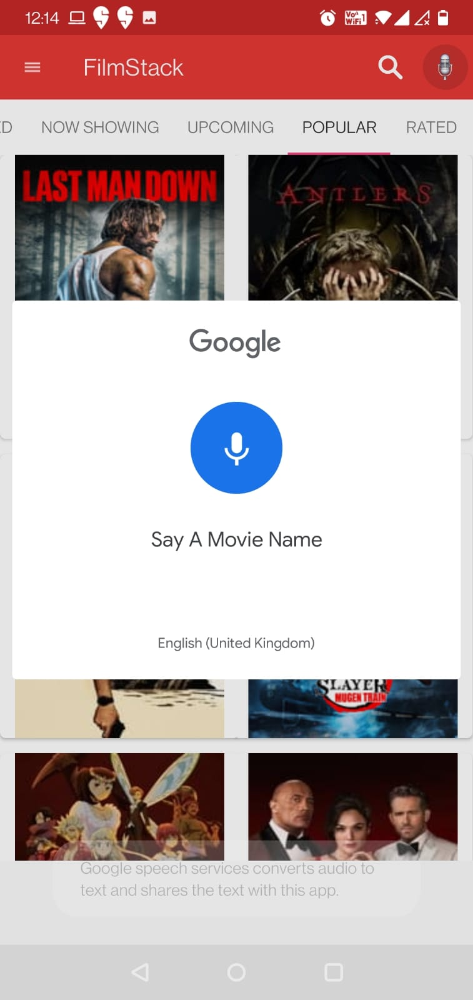
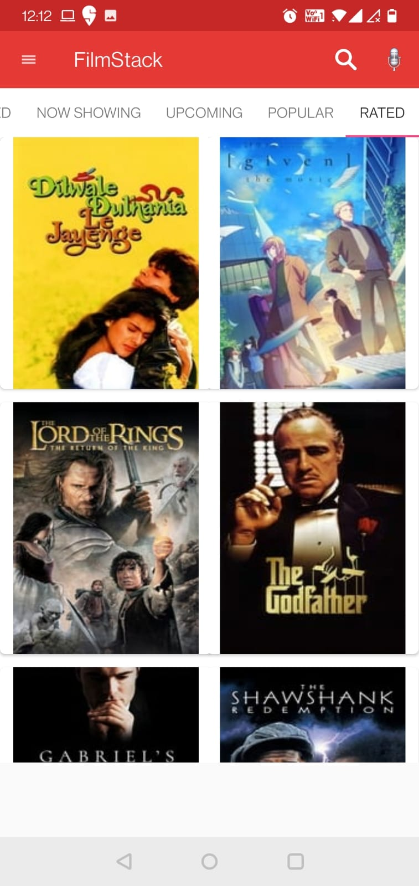
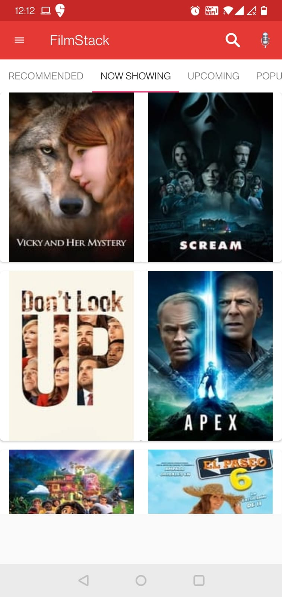
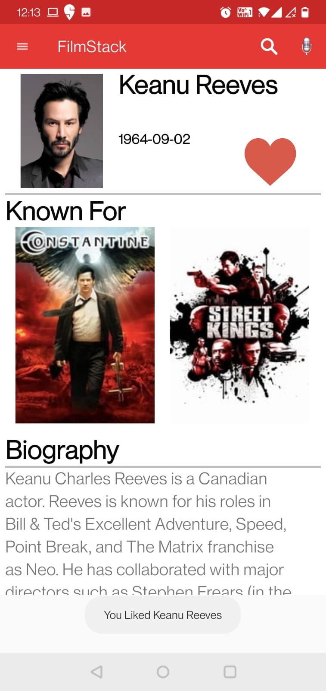

# 🎬 Filmstack

> A smart Android movie discovery app — personalized recommendations, trailer playback, reminders, and more.

[](https://www.java.com)
[](https://developer.android.com)
[](https://firebase.google.com)
[](https://www.themoviedb.org)
[](LICENSE)

---

## 📱 Screenshots

<p align="center">
  
  
  
  
</p>
<p align="center">
  
  
  
  
</p>

---

## ✨ Features at a Glance

| Feature | Description |
|---|---|
| 🎯 **Personalized Recommendations** | AI-style scoring from favourite actors, genres and watch history |
| 🎬 **Trailer Playback** | Custom video player using YouTube links via TMDB API |
| 🌐 **Instant Watch** | Searches the web for streamable MP4 links |
| 🔔 **Movie Reminders** | Schedule reminders with AlarmManager + SQLite |
| 🔖 **Watchlist / Bookmark** | Save movies to a local Watch Later database |
| 🎭 **Actor Profiles** | Search actors and browse all their films |
| 🎞 **Genre Filtering** | Browse movies by category using TMDB genre list |
| 🖼 **Image Caching** | Local blob storage via Picasso for faster loading |
| 📜 **Watch History** | Tracked locally to refine recommendations |
| 🎤 **Voice Search** | Find movies with speech-to-text |
| 📤 **Social Sharing** | Share movie details and download links with friends |

---

## 🛠 Tech Stack

| Layer | Technology |
|---|---|
| Language | Java |
| Platform | Android SDK |
| Cloud Database | Firebase (NoSQL) |
| Local Database | SQLite |
| Movie Metadata | TMDB API |
| Trailer Links | YouTube Data API (via TMDB) |
| Streaming Links | Openload API |
| Image Loading | Picasso |
| Build System | Gradle |

---

## 🚀 Getting Started

### Prerequisites

- Android Studio (Flamingo or later recommended)
- Android SDK 21+
- A [TMDB API key](https://www.themoviedb.org/settings/api)
- A [Firebase project](https://console.firebase.google.com)

### Setup

**1. Clone the repo**
```bash
git clone https://github.com/jitu2611/Filmstack.git
cd Filmstack
```

**2. Add your API keys** — create `app/src/main/res/values/api_keys.xml`:
```xml
<resources>
  <string name="tmdb_api_key">YOUR_TMDB_KEY_HERE</string>
</resources>
```

**3. Connect Firebase** — download `google-services.json` from your Firebase console and place it in `app/`

**4. Build and run** — open the project in Android Studio and click **Run**

---

## 🔍 How Recommendations Work

Filmstack maintains a preference score for each movie genre and actor in Firebase. Each time a user watches, likes, or bookmarks a movie, the associated actor and genre scores are incremented. The recommendation feed is sorted by:

1. **Global popularity** — Firebase counter of how many users liked each movie
2. **Personal preference** — the user's own genre/actor affinity scores

This creates a lightweight collaborative + content-based hybrid recommender with no ML overhead.

---

## 📂 Project Structure

```
Filmstack/
├── app/
│   ├── src/main/java/org/jitu/filmstack/
│   │   ├── MainActivity.java          # Home feed and navigation
│   │   ├── RecommendationEngine.java  # Scoring and Firebase sync
│   │   ├── TrailerActivity.java       # YouTube trailer player
│   │   ├── ReminderActivity.java      # AlarmManager scheduler
│   │   ├── ActorActivity.java         # Actor search and filmography
│   │   ├── ImageCacheDB.java          # SQLite image blob cache
│   │   └── ...
│   └── src/main/res/                  # Layouts, drawables, strings
├── screenshot/                        # App screenshots (1-8.jpeg)
└── build.gradle
```

---

## 🤝 Contributing

Pull requests are welcome! Open an issue first to discuss what you would like to change.

---

## 📄 License

MIT © [jitu2611](https://github.com/jitu2611)
